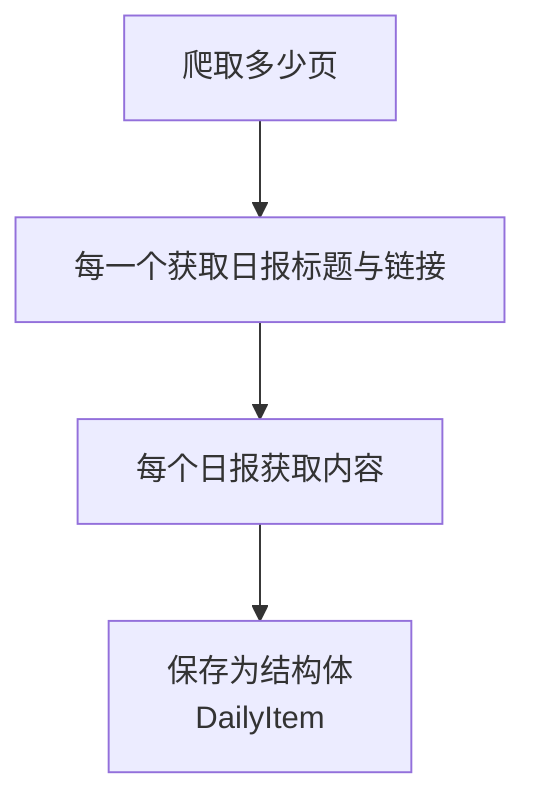

# Rust爬虫练手

## 总体结构

### src

存放各种工具模块，供examples中的爬虫调用

### examples

存放各种示例爬虫

```shell
cargo run --example <exampels中的示例文件>
```

#### rustcc_daily_scraper

> reqwest_tutorial.rs -> 基础版本


```mermaid
flowchart TD
1["爬取多少页"]
2["每一个获取日报标题与链接"]
3["每个日报获取内容"]
4["保存为结构体</br>DailyItem"]
1 --> 2 -->3-->4
```